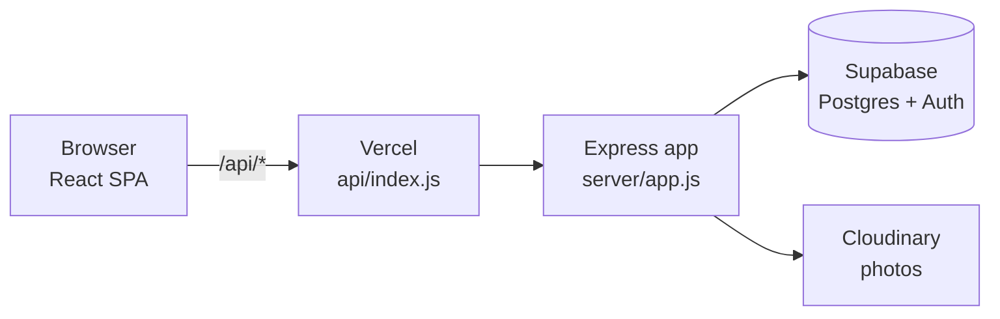
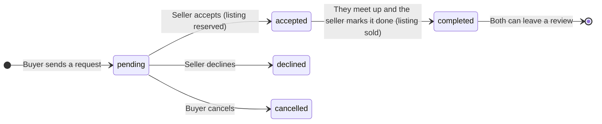

<div align="center">

# School Uniform Exchange Platform

**Buy, sell, and swap pre-loved school uniforms with students on your campus.**

*Exchange · Reuse · Support students*

[](https://school-uniform-exchange-platform.vercel.app)


</div>

---

## Table of contents

- [About](#about)
- [Features](#features)
- [Tech stack](#tech-stack)
- [Architecture](#architecture)
- [Project structure](#project-structure)
- [Getting started](#getting-started)
- [Environment variables](#environment-variables)
- [Available scripts](#available-scripts)
- [API reference](#api-reference)
- [Exchange flow](#exchange-flow)
- [Deployment](#deployment)
- [Design system](#design-system)
- [Contributing](#contributing)
- [Roadmap](#roadmap)

---

## About

Students outgrow uniforms long before the uniforms wear out. **SUEPS** (School Uniform Exchange Platform) gives
them one place to pass those uniforms on: list a uniform in a few minutes, find the right size for less, chat
with the other student, and meet up on campus to hand it over.

It is a single responsive web app that works the same on phones, tablets, and desktops, from a 280 px folding
phone to a 2560 px monitor.

## Features

### For students

| | |
|---|---|
| **Browse and search** | Keyword search across titles and descriptions, category tabs, and filters for size, condition, and price (preset ranges or a custom min/max). Sort by newest or price. Filters live in the URL, so any result is shareable. |
| **Sell in minutes** | Up to 5 photos (compressed in the browser before upload), category, size, condition, price, quantity, and whether you are open to buy, swap, or both. |
| **Requests** | Send a request to buy or swap with an optional note. Sellers accept or decline; buyers can cancel. |
| **Messaging** | One conversation per listing, with photo messages. New messages appear automatically. |
| **Profile** | Your listings, requests you sent and received, completed-exchange stats, and reviews. |
| **Help assistant** | A built-in FAQ assistant answers common questions instantly (runs in the browser, no API calls). |

### For administrators

- Dashboard with platform totals.
- Verify or ban users, remove listings, and review reports.

### Experience

- **Mobile first:** a bottom tab bar with a raised action button on phones; a floating header card on larger screens.
- **Adaptive:** cards adapt to their own width (CSS container queries), short screens get a condensed header and a full-height help panel, and very wide screens show more columns.
- **Accessible:** WCAG AA colour contrast throughout, full keyboard navigation with visible focus, screen-reader labels, and every animation turns off for users who prefer reduced motion.

## Tech stack

| Layer | Technology |
|---|---|
| Frontend | React 18, React Router 7, Vite 8, Tailwind CSS 4, Axios |
| Backend | Node.js 22, Express 4, Helmet, Multer |
| Database and auth | Supabase (PostgreSQL, Supabase Auth, Row Level Security) |
| Sessions | JWT issued by the API, sent as a `Bearer` token |
| Image storage | Cloudinary (production); local `server/uploads` folder in development |
| Hosting | Vercel: static frontend plus the Express API as a serverless function |

## Architecture



- The frontend always calls the API on the **same origin** (`/api`). Locally, Vite proxies `/api` to Express on
  port 5000; on Vercel, every `/api/*` request is routed to one serverless function that runs the same Express app.
- Because serverless functions cannot hold WebSocket connections open, chat updates by **polling** the API every
  few seconds.
- The Supabase **service-role key stays on the server**. The browser never receives it.

## Project structure

```text
School-Uniform-Exchange-Platform/
├── api/
│   └── index.js               Vercel serverless entry: exports the Express app
├── client/                    React frontend (Vite)
│   ├── index.html             Fonts, favicon, and the boot screen shown while the app loads
│   └── src/
│       ├── api.js             Axios instance: same-origin /api, adds the JWT
│       ├── App.jsx            Routes and page layout
│       ├── index.css          Design tokens, shared component classes, animations
│       ├── helpFaq.js         Help assistant questions and answers
│       ├── context/           AuthContext (current user, login, logout)
│       ├── components/        Navbar, ListingCard, SearchBar, HelpChat, CategoryGrid, AuthLayout, ...
│       └── pages/             Splash, Home, Browse, ListingDetails, Sell, Messages, Profile, Admin, Login, Register
├── server/                    Express API
│   ├── app.js                 Express app: middleware and routes (shared by local server and Vercel)
│   ├── server.js              Local development entry point (port 5000)
│   ├── seed.js                Sample users and listings
│   ├── config/                Supabase helpers, Cloudinary
│   ├── middleware/            JWT auth and admin guard, uploads, error handling
│   ├── routes/                auth, listings, requests, messages, users, admin
│   └── supabase/schema.sql    Tables, triggers, and Row Level Security policies
├── vercel.json                Build settings and /api rewrites
└── render.yaml                Optional: run the API as a standalone Render service
```

## Getting started

### Prerequisites

- [Node.js](https://nodejs.org/) **22 or newer**
- A [Supabase](https://supabase.com/) project
- *(Optional)* A free [Cloudinary](https://cloudinary.com/) account for photo uploads

### 1. Set up the database

In the Supabase dashboard, open **SQL Editor**, paste the contents of `server/supabase/schema.sql`, and run it once.

### 2. Run the API

```bash
cd server
npm install
cp .env.example .env     # then fill in the values (see Environment variables)
npm run seed             # optional: sample users and listings
npm run dev              # http://localhost:5000
```

### 3. Run the frontend (in a second terminal)

```bash
cd client
npm install
npm run dev              # http://localhost:5173
```

Open <http://localhost:5173>. Vite forwards every `/api` request to the API on port 5000.

### Demo accounts

After `npm run seed`, you can sign in with:

| Role | Email | Password |
|---|---|---|
| Admin | `admin@school.edu` | `admin123` |
| Student | `juan@school.edu` | `student123` |
| Student | `maria@school.edu` | `student123` |

> [!WARNING]
> These passwords are for local development only. Change or delete the seed accounts before using a public database.

## Environment variables

### Server (`server/.env`)

| Variable | Required | Description |
|---|---|---|
| `PORT` | No | Port for local development (default `5000`). |
| `JWT_SECRET` | **Yes** | Long random string used to sign session tokens. |
| `CLIENT_URL` | **Yes** | Allowed browser origins, comma-separated, no trailing slash. |
| `SUPABASE_URL` | **Yes** | Supabase project URL (Project Settings → API). |
| `SUPABASE_ANON_KEY` | **Yes** | Supabase anon (public) key. |
| `SUPABASE_SERVICE_ROLE_KEY` | **Yes** | Supabase service-role key. **Server only. Never commit it or expose it to the client.** |
| `CLOUDINARY_CLOUD_NAME` | Production | Cloudinary credentials. Without them, photos are saved to `server/uploads` (local development only). |
| `CLOUDINARY_API_KEY` | Production | |
| `CLOUDINARY_API_SECRET` | Production | |

### Client (`client/.env.local`, optional)

| Variable | Description |
|---|---|
| `VITE_SUPABASE_URL` | Supabase project URL. Reserved for direct Supabase access from the browser; not used by any page yet. |
| `VITE_SUPABASE_ANON_KEY` | Supabase anon (public) key. Same as above. |

The client needs no variables to run, and no API URL: it always uses the same-origin `/api`.

## Available scripts

| Location | Command | What it does |
|---|---|---|
| `server/` | `npm run dev` | Start the API with auto-reload on file changes |
| `server/` | `npm start` | Start the API |
| `server/` | `npm run seed` | Insert sample users and listings |
| `client/` | `npm run dev` | Start the Vite dev server |
| `client/` | `npm run build` | Build the production bundle into `client/dist` |
| `client/` | `npm run preview` | Serve the production build locally |

## API reference

All endpoints are under `/api`. Endpoints marked 🔒 need an `Authorization: Bearer <token>` header; 🛡️ also needs an admin account.

| Method | Endpoint | | Description |
|---|---|---|---|
| `GET` | `/health` | | Health check |
| `POST` | `/auth/register` | | Create an account |
| `POST` | `/auth/login` | | Sign in and receive a token |
| `GET` | `/auth/me` | 🔒 | Current user |
| `GET` | `/listings` | | Browse. Query: `q`, `category`, `size`, `condition`, `minPrice`, `maxPrice`, `sort`, `page`, `limit` |
| `GET` | `/listings/mine` | 🔒 | My listings |
| `GET` | `/listings/:id` | | Listing details |
| `POST` | `/listings` | 🔒 | Create a listing (`multipart/form-data`, up to 5 `photos`) |
| `PUT` | `/listings/:id` | 🔒 | Update my listing |
| `DELETE` | `/listings/:id` | 🔒 | Delete my listing |
| `POST` | `/requests` | 🔒 | Send a buy or swap request |
| `GET` | `/requests/incoming` | 🔒 | Requests for my listings |
| `GET` | `/requests/outgoing` | 🔒 | Requests I sent |
| `PATCH` | `/requests/:id/status` | 🔒 | `accepted`, `declined`, `cancelled`, or `completed` |
| `GET` | `/messages/conversations` | 🔒 | My conversations |
| `POST` | `/messages/conversations` | 🔒 | Start a conversation about a listing |
| `GET` | `/messages/conversations/:id/messages` | 🔒 | Message history |
| `POST` | `/messages/conversations/:id/messages` | 🔒 | Send a message (text and/or photo) |
| `GET` | `/users/me/stats` | 🔒 | Profile counts |
| `PUT` | `/users/me` | 🔒 | Update my profile |
| `GET` | `/users/:id` | | Public profile |
| `POST` | `/users/reviews` | 🔒 | Review the other student after an exchange |
| `POST` | `/users/reports` | 🔒 | Report a user or listing |
| `GET` | `/admin/stats` | 🛡️ | Dashboard totals |
| `GET` `PATCH` | `/admin/users`, `/admin/users/:id` | 🛡️ | List users; verify or ban a user |
| `GET` `DELETE` | `/admin/listings`, `/admin/listings/:id` | 🛡️ | List and remove listings |
| `GET` `PATCH` | `/admin/reports`, `/admin/reports/:id` | 🛡️ | List and resolve reports |

## Exchange flow



## Deployment

The whole app deploys to **Vercel** from this repository, using the settings in [`vercel.json`](vercel.json):

1. Import the repository in Vercel. Keep the **root directory** as the repository root.
2. Add the server [environment variables](#environment-variables) in **Project Settings → Environment Variables**.
   Set `CLIENT_URL` to your Vercel URL, and add the Cloudinary keys, which are required in production.
3. Deploy. Vercel builds `client/` into static files and serves `/api/*` from `api/index.js`.
4. In Supabase, go to **Authentication → URL Configuration** and set **Site URL** to your Vercel URL so
   confirmation emails link back to the app.

*Optional:* [`render.yaml`](render.yaml) can run the API as a standalone Render web service instead.

## Design system

| Token | Value | Used for |
|---|---|---|
| Anchor Navy | `#0E3661` | Buttons, links, dark panels, active states |
| Snow White | `#FFFFFF` | Page background, cards, header |
| Blends | mixes of the two | Borders, fills, hover tints, secondary text |
| Typeface | [Poppins](https://fonts.google.com/specimen/Poppins) | All text (weights 400–800) |

All colours are defined once as design tokens in `client/src/index.css`, together with the shared component
classes (`btn-primary`, `card`, `control`, `tab`, `chip`, ...). Change a token there and the whole site follows.

## Contributing

1. Create a branch from `main` for your change.
2. Keep commits small and descriptive, for example `feat(ui): ...` or `fix(api): ...`.
3. **Commit before you pull**, then rebase onto the latest `main`:

   ```bash
   git add -A
   git commit -m "feat(ui): describe your change"
   git pull --rebase origin main
   git push origin <your-branch>
   ```

4. Never commit `.env` files or keys. Only the `.env.example` templates belong in the repository.

## Roadmap

- [ ] Edit-listing page and password reset
- [ ] Input validation and rate limiting on the auth endpoints
- [ ] Student-ID verification before a user can post
- [ ] A school field, so different schools' uniforms stay separate
- [ ] Unread-message badges, and request status shown inside the chat
- [ ] Automated tests

---

<div align="center">
<sub>Made for students, by students.</sub>
</div>
